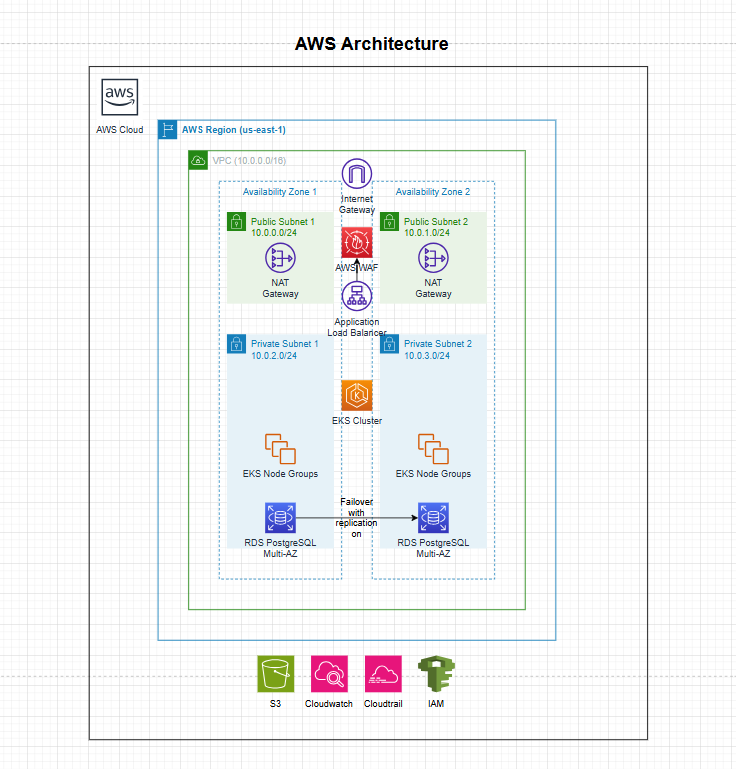

# AWS Cloud Infrastructure Design

## 📘 Section 1: Infrastructure Design, Cost Optimization & IaC

### Problem Statement
Your company runs a customer engagement platform that serves millions of users. The platform experiences sudden traffic spikes during promotional campaigns and requires a highly available, scalable, and cost-efficient cloud infrastructure.

### Current Challenges
- **Unscalable Architecture**: Running on manually provisioned EC2 instances in a single AWS region.
- **High AWS Costs**: No clear optimization strategies; inefficient resource allocation.
- **No Automation**: Manual provisioning causes configuration drift and slow deployments.
- **Security & Compliance Gaps**: No proper IAM, encryption, or network segmentation.

### Business Requirements
1. High availability with multi-region support.
2. Reduce AWS costs by at least 30%.
3. Enhance security using IAM best practices, encryption, and segmentation.
4. Use Terraform or CloudFormation for automated infrastructure provisioning.

---

## Section 2: AWS Architecture Design

### Compute
- **Amazon EKS (Elastic Kubernetes Service)** for container orchestration.
  - Auto-scaling node groups (Spot + On-Demand mix).
  - Pod auto-scaling for traffic bursts.
  - Alternative: Lambda for stateless APIs.

### Storage & Caching
- **Amazon RDS (PostgreSQL)**: Multi-AZ relational database.
- **Amazon S3**: Object storage for logs, assets.
- **ElastiCache Redis**: Session & in-memory caching.

### Networking & Security
- VPC with public/private subnets across **two regions**.
- NAT Gateway for private subnet internet access.
- ALB (Application Load Balancer) + WAF.
- IAM Roles with least privilege.
- Encryption with AWS KMS for RDS, S3, EBS.
- VPC Flow Logs enabled.

### CI/CD Integration
- **GitHub Actions** for IaC pipeline:
  - Plan → Validate → Apply
  - Integrated via **OIDC to AWS** (no secrets stored)

### Architecture Diagram Layout 


---

## Section 3: Terraform-Based Infrastructure Implementation

### Terraform Folder Structure
```
infra/
├── modules/
│   ├── vpc/
│   ├── eks/
│   ├── rds/
│   └── alb/
├── environments/
│   └── prod/
│       ├── main.tf
│       ├── variables.tf
│       └── terraform.tfvars
└── backend.tf
```

### Core Terraform Resources
- **VPC Module**
  - CIDR, subnets, NAT Gateways
- **EKS Module**
  - Cluster with autoscaling node groups
- **RDS Module**
  - PostgreSQL with multi-AZ, KMS encryption
- **ALB Resource**
  - Integrated with WAF
- **IAM Roles**
  - Scoped access for EKS, CI/CD, RDS
- **S3**
  - Created as reusable modules or external resources

---

## Section 4: Design Justification & Trade-offs

### Why Terraform?
- Modular, reusable.
- Strong community and open-source modules.
- Git-based versioning and automation-friendly.

### Service Trade-offs

| Choice           | Justification                                       |
|------------------|------------------------------------------------------|
| EKS over ECS     | More flexible for scaling microservices              |
| RDS over DynamoDB| Structured schema, easier to migrate relational data |
| GitHub Actions   | Native GitHub integration with OIDC support          |

### Cost Optimization Strategies
- EC2 Spot Instances in EKS node groups
- Auto-scaling groups for compute
- Use of S3 for log storage
- Scheduled shutdown for non-prod environments
- One NAT Gateway per AZ (not per subnet)

---

## Section 5: Testing Infrastructure as Code

### Testing Approach
- **Unit Testing**: Individual module validation
- **Integration Testing**: Full infrastructure validation
- **Mock Testing**: Using mock AWS providers to avoid real AWS resources

### Test Structure
```
infra/
├── modules/
│   ├── vpc/
│   │   └── vpc.tftest.hcl    # VPC module tests
│   ├── eks/
│   │   └── eks.tftest.hcl    # EKS module tests
│   └── ...
├── test/
│   ├── integration.tftest.hcl # Integration tests
│   └── main.tf               # Test infrastructure
└── run_all_tests.ps1        # Test runner script
```

### Running Tests
- **Windows**: Execute `.\run_all_tests.ps1` from the `infra` directory
- **Linux/Mac**: Execute `./run_all_tests.sh` from the `infra` directory

### Test Mocking Strategy
- Mock AWS provider to avoid real AWS API calls
- Test assertions to validate resource configurations
- Skip credential validation for local testing
- Use LocalStack for more advanced testing scenarios

### Continuous Integration
- Automated tests run on every pull request
- Terraform validation and security scanning
- Plan output for review before applying changes

### Test Results
- [View latest test results](./infra/testresult.md)

